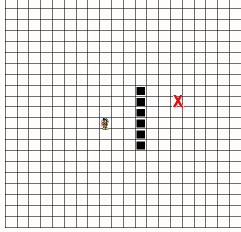

# 寻路算法


### 介绍   
如果你玩过MMOARPG游戏，比如魔兽，你会发现人物行走会很有趣，为了模仿人物行走的真实体验，他们会选择最近路线达到目的地，期间会避开高山或者湖水，绕过箱子或者树林，直到走到你所选定的目的地。

### 公式    
$$F(n) = G(n) + H(n)$$  
G: 从起点走到当前格的成本  
H: 从当前格走到目标格的距离，不考虑障碍的情况   
F: G和H的综合评估，F值越小越好  

### 实现
在运用此公式前，我们需要以下定义:   
 * mapList: 地图
 * openList: 存储可到达的格子
 * closeList: 存储已到达的格子
 * startPos: 起点
 * endPos: 终点

### 代码
```
    /**
     * 用一个二维数组代表地图
     * 0代表目标可达，1代表此处有障碍，2代表自己(起点)，3代表目标(终点)
     */ 

    class Game{
        mapList = [];
        gridW = 20;
        gridH = 20;
        startPos = { x: 8, y: 10 };
        endPos = { x: 15, y: 8 };
        closeList = [];
        constructor() {
            this.createMapList();
            // 添加障碍物
            this.addObstacle();
            // 添加自己(起点)
            this.addMapPoint(this.startPos, 2);
            // 添加目标点(终点)
            this.addMapPoint(this.endPos, 3)
        }
        // 创建地图
        createMapList() {
            for(var i = 0; i < this.gridH; i++) {
                this.mapList[i] = [];
                for(var j = 0; j < this.gridW; j++) {
                    this.mapList[i][j] = 0;
                }
            }
        }
        // 添加节点
        addMapPoint(pos, type) {
            this.mapList[pos.y][pos.x] = type;
        }
        addObstacle() {
            for(var i = 0; i < 6; i++) {
                let p = { x: 11, y: 7 + i };
                this.addMapPoint(p, 1);
            }
        }
        // 开始寻路
        start() {
            let curPos = this.startPos;
            while(curPos = this.findRoad(curPos)) {
                if (this.isMoveEnd(curPos)) {
                    console.log('到达终点');
                    console.log('行走路径', this.closeList);
                    return;
                }
            }
            console.log('无法找到能到达目的地的路径', this.closeList);
        }
        isMoveEnd(pos) {
            return pos.x == this.endPos.x && pos.y == this.endPos.y;
        }
        // 寻路
        findRoad(curPos) {
            let openList = this.getOpenList(curPos);
            openList = this.filterList(openList);
            let step, nextStep, minF = Number.MAX_VALUE;
            while(step = openList.pop()) {
                if (this.isMoveEnd(step)) {
                    return step;
                }

                let f = this.f(step);
                if (f < minF) {
                    // 找到最小的F值
                    minF = f;
                    nextStep = step;
                }
            }
            if (!nextStep) {
                // 无路可走
                return null;
            }
            this.closeList.push(nextStep);
            return nextStep;
        }
        // 过滤已走过的路
        filterList(list) {
            return list.filter(({x: a, y: b}) => (
                !this.closeList.find(({x, y}) => a == x && b == y)
            ));
        }
        getOpenList(pos) {
            let openList = [];
            // 按照上右下左查询
            if (pos.y > 0 && this.mapList[pos.y - 1][pos.x] != 1) {
                openList.push({ x: pos.x, y: pos.y - 1 });
            }
            if (pos.x < this.gridW - 1 && this.mapList[pos.y][pos.x + 1] != 1) {
                openList.push({ x: pos.x + 1, y: pos.y });
            }
            if (pos.y < this.gridH - 1 && this.mapList[pos.y + 1][pos.x] != 1) {
                openList.push({ x: pos.x, y: pos.y + 1 });
            }
            if (pos.x > 0 && this.mapList[pos.y][pos.x - 1] != 1) {
                openList.push({ x: pos.x - 1, y: pos.y });
            }
            return openList;
        }
        getDistance(pointA, pointB) {
            return Math.abs(pointB.x - pointA.x) + Math.abs(pointB.y - pointA.y);
        }
        f(pos) {
            let g = this.getDistance(this.startPos, pos);
            let h = this.getDistance(pos, this.endPos);
            return g + h;
        }
    }

    new Game().start();
```