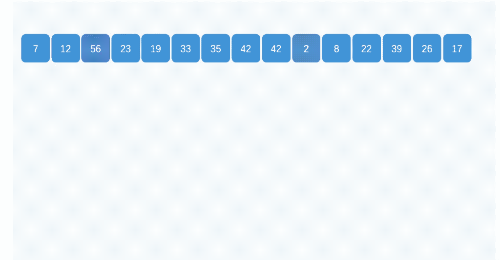

# 桶排序


### 定义
将数组分到有限数量的桶子里，每个桶子再个别排序。

### 代码
```
    function bucketSort(arr) {
        var len = arr.length;
        var bucket = [];
        var index = [];
        for(var i = 0; i < 10; i++) {
            bucket[i] = [];
            index[i] = 0;
            for(var j = 0; j < len; j++) {
                bucket[i][j] = 0;
            }
        }
        var max = 0;
        for(var i = 0; i < len; i++) {
            var t = arr[i].toString().length
            if (max < t) {
                max = t;
            }
        }
        var str;
        for(var i = max - 1; i >= 0; i--) {
            for(j = 0; j < len; j++) {
                str = '';
                var t = arr[j].toString().length;
                if (t < max) {
                    for (var k = 0; k < max - t; k++) {
                        str += "0";
                    }
                }
                str += arr[j].toString();
                bucket[str.charAt(i)][index[str.charAt(i)]++] = arr[j];
            }
            var pos = 0;
            for(var j = 0; j < 10; j++) {
                for (var k = 0; k < index[j]; k++) {
                    arr[pos++] = bucket[j][k];
                }
            }
            for(var j = 0; j < 10; j++) {
                index[j] = 0;
            }
        }
        return arr;
    }
```