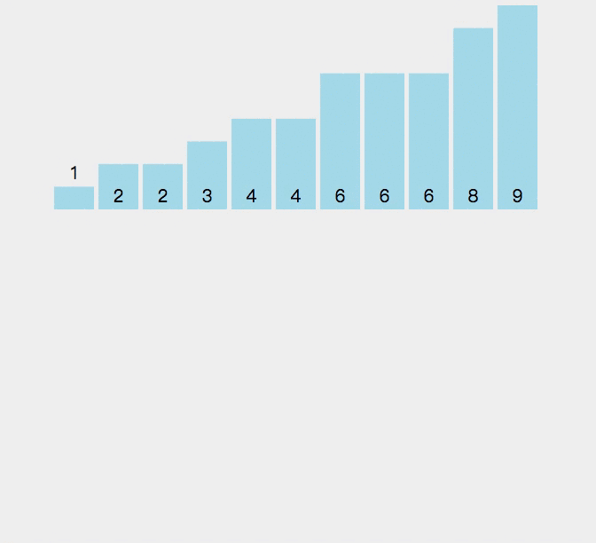

# 计数排序


### 定义
计数排序是一个非基于比较的排序算法。    
假设输入的线性表L的长度为n，L=L1,L2,..,Ln；线性表的元素属于有限偏序集S，|S|=k且k=O(n)，S={S1,S2,..Sk}；则计数排序可以描述如下：     
1. 扫描整个集合S，对每一个Si∈S，找到在线性表L中小于等于Si的元素的个数T(Si)；
1. 扫描整个线性表L，对L中的每一个元素Li，将Li放在输出线性表的第T(Li)个位置上，并将T(Li)减1。

### 代码
```
    function countSort(a) {
        var b = new Array(a.length);
        var max = a[0], min = a[0];
        for(var i = 0; i < a.length; i++) {
            if (a[i] > max) {
                max = a[i];
            }
            if (a[i] < min) {
                min = a[i];
            }
        }
        var j = max - min + 1;
        var c = new Array(j);
        for(var i = 0; i < j; i++) {
            c[i] = 0;
        }
        for(var i = 0; i < a.length; i++) {
            c[a[i] - min] += 1;
        }
        for(var i = 1; i < c.length; i++) {
            c[i] = c[i] + c[i - 1];
        }
        for(var i = a.length - 1; i >= 0; i--) {
        
            b[--c[a[i] - min]] = a[i];
        }
        return b;
    }
```