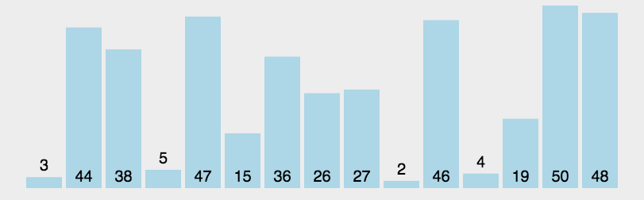

# 堆排序


### 定义
利用堆这种数据结构所设计的一种排序算法。

### 代码
```
    function heapSort(arr) {
        function heap(arr, k, len) {
            var c = arr[k];
            for(var i = 2 * k + 1; i < len; i = 2 * i + 1) {
                if (i + 1 < len && arr[i] < arr[i + 1]) {
                    i++;
                }
                if (arr[i] > c) {
                    [arr[i], arr[k]] = [arr[k], arr[i]];
                    k = i;
                } else {
                    break;
                }
            }
        }

        var center = Math.round(arr.length / 2) - 1;
        for(var i = center; i >= 0; i--) {
            heap(arr, i, arr.length);
        }
        for(var i = arr.length - 1; i > 0; i--) {
            [arr[0], arr[i]] = [arr[i], arr[0]];
            heap(arr, 0, i);
        }
        return arr;
    }
```
