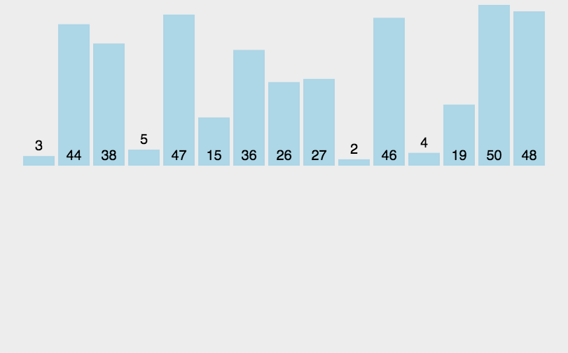

# 归并排序


### 定义
将已有序的子序列合并，得到完全有序的序列；即先使每个子序列有序，再使子序列段间有序。

### 代码
```
    function mergeSort(arr){
        function merge(left, right){
            var result = [];
            while(left.length > 0 && right.length > 0){
                if(left[0] < right[0]){
                    result.push(left.shift());
                } else {
                    result.push(right.shift());
                }
            }
            return result.concat(left).concat(right);
        }
        if(arr.length == 1){
            return arr;
        }
        var center = Math.floor(arr.length / 2);
        var left = arr.slice(0, center);
        var right = arr.slice(center);
        return merge(mergeSort(left), mergeSort(right));
    }
```