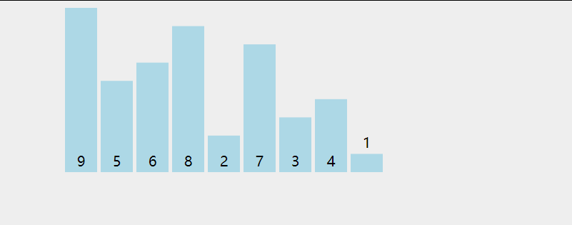

# 选择排序


### 定义
第一次从待排序的数据元素中选出最小（或最大）的一个元素，存放在序列的起始位置，然后再从剩余的未排序元素中寻找到最小（大）元素，然后放到已排序的序列的末尾。以此类推，直到全部待排序的数据元素的个数为零。

### 思路
1. 我们先循环数组找到最小的元素，和数组的第一个交换位置。
1. 执行上一步后，第一个元素为排列好的元素，接着循环数组(不包含排列好的元素)
1. 直到所有的元素排列好为止

### 代码
1. 第一步:
```
    var arr = [9, 5, 6, 8, 2, 7, 3, 4, 1];
    var min = 0; // 假定第一个为最小
    for (var i = 0; i < arr.length; i++) {
        if (arr[i] < arr[min]) {
            min = i;
        }
    }
    // 交换位置
    [arr[0], arr[min]] = [arr[min], arr[0]];
```
1. 第二步:
```
    /**
     * 用一个变量记录已排序好的个数
     * 每次排序后，变量值+1
     * 直到变量值为数组长度为止
     */
    var arr = [9, 5, 6, 8, 2, 7, 3, 4, 1];
    var n = 0;
    while(n < arr.length) {
        var min = n; // 假定第一个为最小
        for (var i = n; i < arr.length; i++) {
            if (arr[i] < arr[min]) {
                min = i;
            }
        }
        // 交换位置
        [arr[n], arr[min]] = [arr[min], arr[n]];
        n++;
    }
```
1. 封装:
```
    function selectSort(arr) {
        var n = 0;
        while(n < arr.length) {
            var min = n; // 假定第一个为最小
            for (var i = n; i < arr.length; i++) {
                if (arr[i] < arr[min]) {
                    min = i;
                }
            }
            // 交换位置
            [arr[n], arr[min]] = [arr[min], arr[n]];
            n++;
        }
        return arr;
    }

    // 调用
    var arr = [9, 5, 6, 8, 2, 7, 3, 4, 1];
    selectSort(arr);
```
1. 优化:
 * 假定第一个最小时，不需要从第一个开始比较，从下一个开始比较
 * n为arr.length-1时，不需要比较
```
    function selectSort(arr) {
        var n = 0;
        while(n < arr.length - 1) {
            var min = n; // 假定第一个为最小
            for (var i = n + 1; i < arr.length; i++) {
                if (arr[i] < arr[min]) {
                    min = i;
                }
            }
            // 交换位置
            [arr[n], arr[min]] = [arr[min], arr[n]];
            n++;
        }
        return arr;
    }
```

### 练习
感兴趣的小伙伴可以写一个从大到小的排序，2层for循环